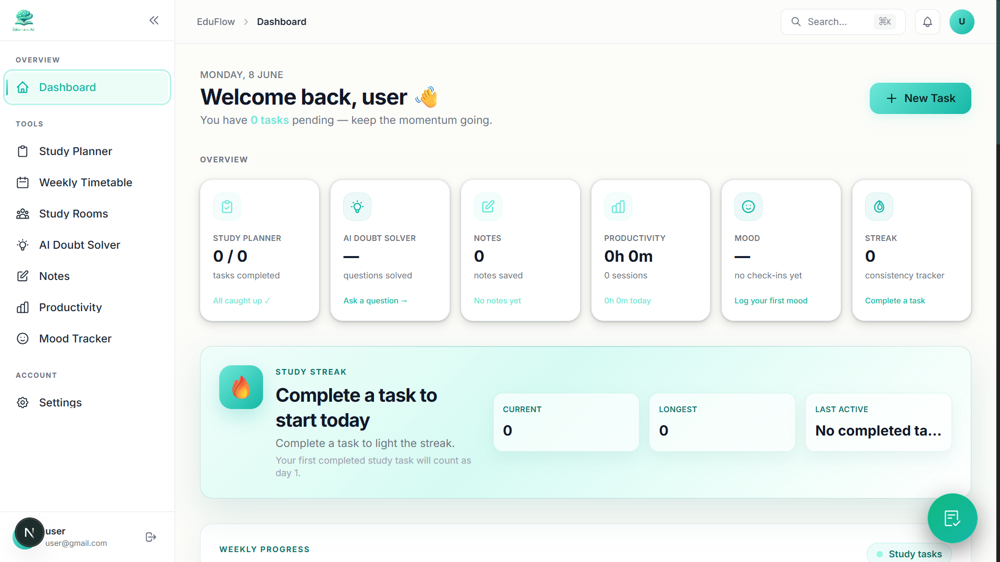
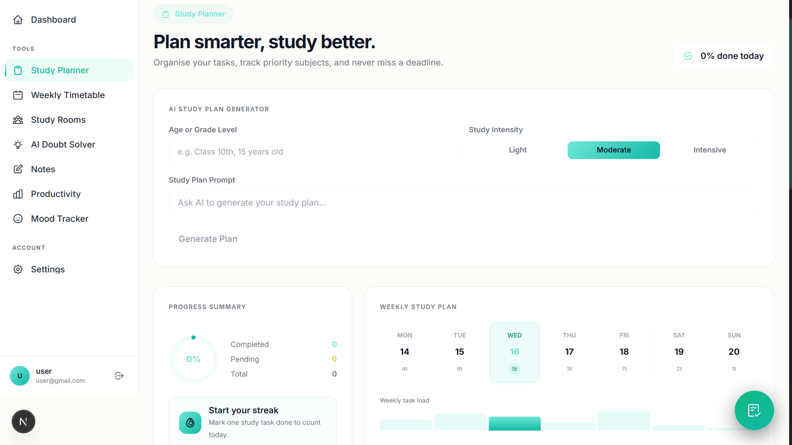
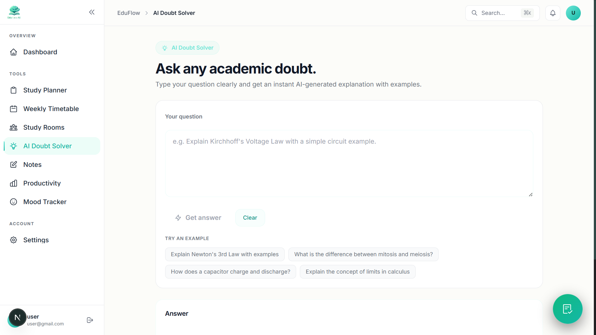
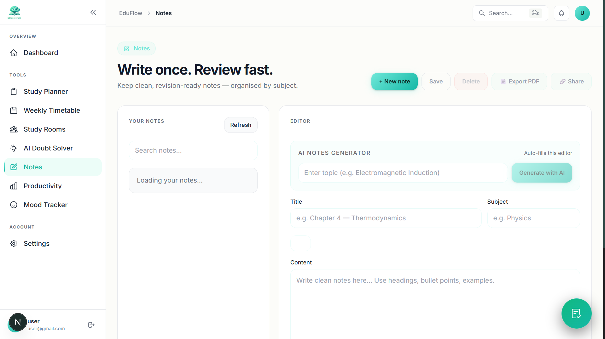

# EduFlow AI

**AI-powered student productivity assistant**

EduFlow AI is a full-stack student assistant SaaS that brings study planning, notes, productivity tracking, mood support, and AI learning tools into one clean dashboard.

---

##  Overview

Students often use too many separate tools for planning, notes, doubts, focus tracking, and motivation. EduFlow AI was built to solve that problem by combining the most useful student workflows in one place.

With EduFlow AI, students can manage study tasks, create and organize notes, ask AI-powered academic questions, track productivity, monitor mood, build daily study streaks, and view weekly progress from a single dashboard.

The goal is simple: help students stay organized, consistent, and supported while studying.

---

##  Features

### Study & Planning

- Study Planner with full CRUD support
- Task completion tracking
- Notifications and reminders
- Daily streak tracking with animations and badges
- Weekly Progress Graph for completed study tasks

### Notes

- Notes CRUD
- AI Notes Generator
- Export notes as PDF
- Shareable notes links
- Organized note management

### AI Learning Tools

- AI Doubt Solver
- AI-generated study notes
- Multi-agent AI architecture
- LLM-powered academic assistance

### Productivity & Wellness

- Productivity Tracker
- Mood Tracker
- Mood-based suggestions
- Dashboard overview cards
- Premium light mint/teal UI

---

##  AI Capabilities

EduFlow AI uses AI APIs through OpenRouter / LLM providers to make studying more interactive and helpful.

### AI Doubt Solver

Students can ask academic questions and receive clear, AI-generated explanations. This helps reduce friction when they get stuck while studying.

### AI Notes Generator

Students can generate structured study notes from prompts, topics, or learning goals. This makes it easier to start studying without staring at a blank page.

### Multi-Agent Architecture

The project includes a multi-agent AI approach, allowing different AI workflows to support different parts of the app, such as doubt solving, notes generation, and productivity assistance.

---

##  Tech Stack

### Frontend

- Next.js
- TypeScript
- Tailwind CSS
- React

### Backend & Database

- Supabase Auth
- Supabase Database
- Row Level Security policies

### AI & APIs

- Google Gemini API
- AI-powered notes generation
- AI-powered doubt solving

### Utilities

- PDF export
- Notifications and reminders
- Responsive dashboard UI

---

## 📸 Screenshots

> Replace these placeholder images with real screenshots when available.









---
## discord channel 
https://discord.gg/NbbqfpdPeK

---

## ⚙️ Setup Instructions

### 1. Clone the repository

```bash
git clone https://github.com/your-username/eduflow-ai.git
cd eduflow-ai
```

### 2. Install dependencies

```bash
npm install
```

### 3. Create environment file

Create a `.env` & `env.local` file in the root directory:

```bash
.env{
NEXT_PUBLIC_SUPABASE_URL=
NEXT_PUBLIC_SUPABASE_ANON_KEY=
}
env.local{
AI_PROVIDER=gemini
GEMINI_API_KEY=
GEMINI_MODEL=gemini-2.5-flash-lite
RESEND_API_KEY=
CONTACT_TO_EMAIL=
RESEND_FROM_EMAIL=
}
```

Add your Supabase project URL, Supabase anon key, and AI API key. EduFlow AI uses Gemini when `AI_PROVIDER=gemini`, and can fall back to the OpenRouter/OpenAI-compatible key 

### 4. Run the development server

```bash
npm run dev
```

Open the app in your browser:

```text
(https://eduflow-ai-olive.vercel.app/)
```

### 5. Build for production

```bash
npm run build
```

## Environment Variables

EduFlow AI separates its environment variables into core required variables (needed for the database and authentication) and optional variables (needed for AI features or email notifications). 

| Variable | File | Status | Description | Default / Example |
| --- | --- | --- | --- | --- |
| `NEXT_PUBLIC_SUPABASE_URL` | `.env` | **Required** | The API endpoint URL for your Supabase project. Required for database connection and user authentication. | `https://your-project.supabase.co` |
| `NEXT_PUBLIC_SUPABASE_ANON_KEY` | `.env` | **Required** | The anonymous client key for your Supabase project. Used for authenticating requests. | `eyJhbGciOiJIUzI1NiIsInR5c...` |
| `AI_PROVIDER` | `.env.local` | *Optional* | The LLM provider to use for AI features. | `gemini` |
| `GEMINI_API_KEY` | `.env.local` | *Optional* | API key for Google Gemini. Required for AI Doubt Solver, AI Notes Generator, and Study Room AI suggestions. If missing, AI features will be greyed out. | `AIzaSy...` |
| `GEMINI_MODEL` | `.env.local` | *Optional* | The specific Gemini model identifier to use. | `gemini-2.5-flash-lite` |
| `RESEND_API_KEY` | `.env.local` | *Optional* | API key for Resend email service. Required for sending contact form submissions. | `re_123456789...` |
| `CONTACT_TO_EMAIL` | `.env.local` | *Optional* | Destination email address to receive contact form submissions. | `support@eduflow.ai` |
| `RESEND_FROM_EMAIL` | `.env.local` | *Optional* | The verified sender email address in Resend for sending messages. | `onboarding@resend.dev` |

> [!NOTE]
> Contributors who do not wish to work on AI or email features can skip setting `GEMINI_API_KEY` and `RESEND_API_KEY`. The core study planner, notes CRUD, productivity tracker, and timetable features will remain fully functional, and the inactive features will be gracefully disabled in the UI.

---

##  Key Features Highlight

### Streak System

EduFlow AI tracks daily study consistency based on completed study tasks. The dashboard includes animated streak UI, milestone badges, longest streak tracking, and last active date display.

### Weekly Progress Graph

The dashboard shows a clean 7-day bar chart based on completed study tasks. This helps students quickly understand their study momentum across the week.

### AI Integration

AI tools are built directly into the study workflow, so students can generate notes, solve doubts, and get help without leaving the app.

---

##  Challenges I Faced

Building EduFlow AI involved several real-world challenges:

- Handling async state across multiple dashboard widgets in Next.js
- Keeping the dashboard responsive while showing a lot of useful data
- Fixing TypeScript and production build issues while adding new features
- Integrating AI APIs in a reliable and user-friendly way
- Understanding and configuring Supabase Auth, database queries, and RLS policies
- Managing many features together without breaking existing workflows
- Designing a clean UI that feels premium but still practical for daily student use

---

##  Future Improvements

- Heatmap calendar for long-term study consistency
- Advanced AI study insights
- Personalized study recommendations
- Mobile app version
- Better analytics for productivity and mood trends
- Collaborative study spaces
- More export and sharing options

---

##  Contributing

Contributions are welcome.

If you would like to improve EduFlow AI:

1. Fork the repository
2. Create a new feature branch
3. Make your changes
4. Submit a pull request

Please keep changes clean, focused, and easy to review.

---

## 💖 Contributors

Thanks to all the amazing people who contribute to **EduFlow-AI** 🚀

<p align="center">
  <a href="https://github.com/prabhakarshukla/EduFlow-AI/graphs/contributors">
    
  </a>
</p>

---

## ⭐ Project Support

<p align="center">
  <a href="https://github.com/prabhakarshukla/EduFlow-AI/stargazers">
    
  </a>
  &nbsp;&nbsp;
  <a href="https://github.com/prabhakarshukla/EduFlow-AI/network/members">
    
  </a>
</p>

---

##  License

This project is licensed under the MIT License.

---

##  Acknowledgements

Thanks to the tools and platforms that make this project possible:

- Next.js
- Supabase
- Tailwind CSS
- OpenRouter
- LLM providers
- Vercel ecosystem

---

##  Contact

- GitHub: https://github.com/prabhakarshukla
- LinkedIn: www.linkedin.com/in/prabhakar-shukla-90334b399
- Instagram: https://www.instagram.com/prabhakar_.shukla
- Gmail: prabhakarshukla669@gmail.com 
